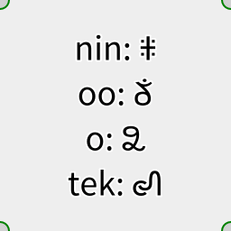

## Mro Unicode rendering in Mapnik

### Background

 - http://phjamr.github.io/mro.html
 - https://github.com/mapbox/tilemill/issues/2138

## Depends

 - Mapnik `hb-prep` branch (more details via https://github.com/mapnik/mapnik/issues/2043)

## Test

    python render.py

Should look like: 